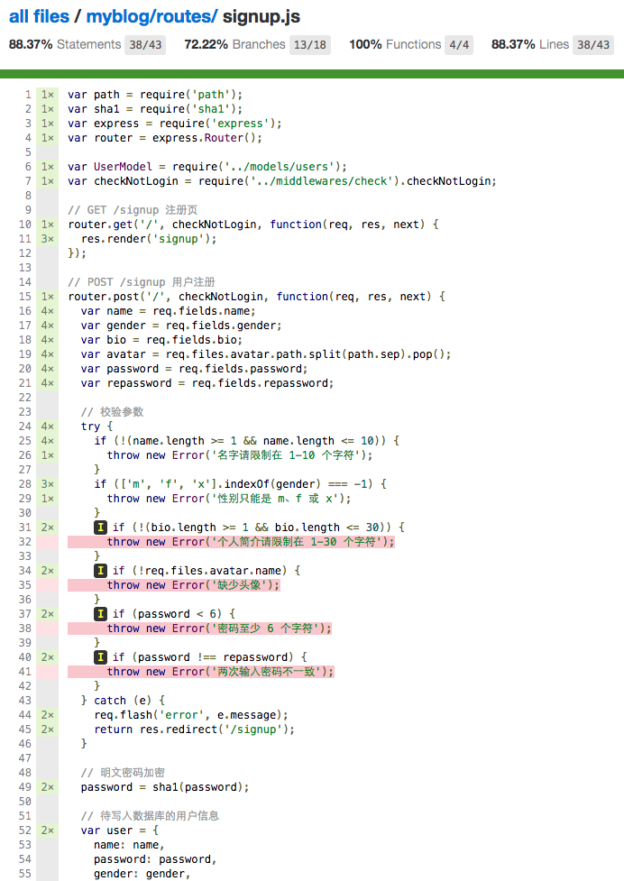

## 4.14.1 mocha 和 supertest

[mocha](https://www.npmjs.com/package/mocha) 和 [suptertest](https://www.npmjs.com/package/supertest) 是常用的测试组合，通常用来测试 restful 的 api 接口，这里我们也可以用来测试我们的博客应用。
在 myblog 下新建 test 文件夹存放测试文件，以注册为例讲解 mocha 和 supertest 的用法。首先安装所需模块：

```sh
npm i mocha supertest --save-dev
```

修改 package.json，将：

**package.json**

```json
"scripts": {
  "test": "echo \"Error: no test specified\" && exit 1"
}
```

修改为：

```json
"scripts": {
  "test": "mocha test"
}
```

指定执行 test 目录的测试。修改 index.js，将：

**index.js**

```js
// 监听端口，启动程序
app.listen(config.port, function () {
  console.log(`${pkg.name} listening on port ${config.port}`)
})
```

修改为:

```js
if (module.parent) {
  // 被 require，则导出 app
  module.exports = app
} else {
  // 监听端口，启动程序
  app.listen(config.port, function () {
    console.log(`${pkg.name} listening on port ${config.port}`)
  })
}
```

这样做可以实现：直接启动 index.js 则会监听端口启动程序，如果 index.js 被 require 了，则导出 app，通常用于测试。

找一张图片用于测试上传头像，放到 test 目录下，如 avatar.png。新建 test/signup.js，添加如下测试代码：

**test/signup.js**

```js
const path = require('path')
const assert = require('assert')
const request = require('supertest')
const app = require('../index')
const User = require('../lib/mongo').User

const testName1 = 'testName1'
const testName2 = 'nswbmw'
describe('signup', function () {
  describe('POST /signup', function () {
    const agent = request.agent(app)// persist cookie when redirect
    beforeEach(function (done) {
      // 创建一个用户
      User.create({
        name: testName1,
        password: '123456',
        avatar: '',
        gender: 'x',
        bio: ''
      })
        .exec()
        .then(function () {
          done()
        })
        .catch(done)
    })

    afterEach(function (done) {
      // 删除测试用户
      User.remove({ name: { $in: [testName1, testName2] } })
        .exec()
        .then(function () {
          done()
        })
        .catch(done)
    })

    after(function (done) {
      process.exit()
    })

    // 用户名错误的情况
    it('wrong name', function (done) {
      agent
        .post('/signup')
        .type('form')
        .attach('avatar', path.join(__dirname, 'avatar.png'))
        .field({ name: '' })
        .redirects()
        .end(function (err, res) {
          if (err) return done(err)
          assert(res.text.match(/名字请限制在 1-10 个字符/))
          done()
        })
    })

    // 性别错误的情况
    it('wrong gender', function (done) {
      agent
        .post('/signup')
        .type('form')
        .attach('avatar', path.join(__dirname, 'avatar.png'))
        .field({ name: testName2, gender: 'a' })
        .redirects()
        .end(function (err, res) {
          if (err) return done(err)
          assert(res.text.match(/性别只能是 m、f 或 x/))
          done()
        })
    })
    // 其余的参数测试自行补充
    // 用户名被占用的情况
    it('duplicate name', function (done) {
      agent
        .post('/signup')
        .type('form')
        .attach('avatar', path.join(__dirname, 'avatar.png'))
        .field({ name: testName1, gender: 'm', bio: 'noder', password: '123456', repassword: '123456' })
        .redirects()
        .end(function (err, res) {
          if (err) return done(err)
          assert(res.text.match(/用户名已被占用/))
          done()
        })
    })

    // 注册成功的情况
    it('success', function (done) {
      agent
        .post('/signup')
        .type('form')
        .attach('avatar', path.join(__dirname, 'avatar.png'))
        .field({ name: testName2, gender: 'm', bio: 'noder', password: '123456', repassword: '123456' })
        .redirects()
        .end(function (err, res) {
          if (err) return done(err)
          assert(res.text.match(/注册成功/))
          done()
        })
    })
  })
})
```

此时编辑器会报语法错误（如：describe 未定义等等），修改 .eslintrc.json 如下：

```json
{
  "extends": "standard",
  "globals": {
    "describe": true,
    "beforeEach": true,
    "afterEach": true,
    "after": true,
    "it": true
  }
}
```

这样，eslint 会忽略 globals 中变量未定义的警告。运行 `npm test` 看看效果吧，其余的测试请读者自行完成。

## 4.14.2 测试覆盖率

我们写测试肯定想覆盖所有的情况（包括各种出错的情况及正确时的情况），但光靠想需要写哪些测试是不行的，总也会有疏漏，最简单的办法就是可以直观的看出测试是否覆盖了所有的代码，这就是测试覆盖率，即被测试覆盖到的代码行数占总代码行数的比例。

> 注意：即使测试覆盖率达到 100% 也不能说明你的测试覆盖了所有的情况，只能说明基本覆盖了所有的情况。

[istanbul](https://www.npmjs.com/package/istanbul) 是一个常用的生成测试覆盖率的库，它会将测试的结果报告生成 html 页面，并放到项目根目录的 coverage 目录下。首先安装 istanbul:

```
npm i istanbul --save-dev
```

配置 istanbul 很简单，将 package.json 中：

**package.json**

```json
"scripts": {
  "test": "mocha test"
}
```

修改为：

```json
"scripts": {
  "test": "istanbul cover _mocha"
}
```

即可将 istanbul 和 mocha 结合使用，运行 `npm test` 终端会打印：


打开 myblog/coverage/Icov-report/index.html，如下所示：


可以点进去查看某个代码文件具体的覆盖率，如下所示：



红色的行表示测试没有覆盖到，因为我们只写了 name 和 gender 的测试。

上一节：[4.13 日志](https://github.com/nswbmw/N-blog/blob/master/book/4.13%20%E6%97%A5%E5%BF%97.md)

下一节：[4.15 部署](https://github.com/nswbmw/N-blog/blob/master/book/4.15%20%E9%83%A8%E7%BD%B2.md)
